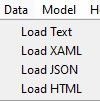
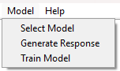
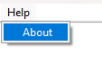

# 🦙 Ollama GUI Application

Welcome to the Ollama GUI Application! This user-friendly interface extends the functionality of Ollama to provide a seamless experience with various data and model operations. Feel free to use (private or commercially), fork, modify, redistribute. Enjoy!

## 🎨 Features

### 📁 File Operations
The File menu offers essential operations:
- **Open**: Load existing files into the application.
- **Save**: Save your current work.
- **Exit**: Exit the application safely.

(https://github.com/SAIPRONE/ollama_gui/assets/95390348/bbe377e5-ea36-4391-9e1d-e105615e8d5b)

### 📊 Data Operations
Easily Train the model with your own data in different data formats using the Data menu:
- **Load Text**: Import plain text files.
- **Load XAML**: Load XAML files.
- **Load JSON**: Import JSON files.
- **Load HTML**: Load HTML files.

()

### 🧠 Model Operations
The Model menu allows you to interact with machine learning models:
- **Select Model**: Choose a model for your tasks (If the model not found it will downloaded it).
- **Generate Response**: Generate responses using the Trained model with your own data.
- **Train Model**: Train a new model with your data.

()

### ❓ Help
Access help and documentation from the Help menu to make the most out of the application.

()

## 🚀 Getting Started

1. **Open a file** from the File menu to start working with your data.
2. **Load data** using the options in the Data menu to import various formats.
3. **Select a model** from the Model menu to start generating responses or training new models.
4. **Save your work** regularly using the Save option in the File menu.

## 📜 System Requirements

To run the Ollama GUI application, ensure your system meets the following requirements:
- **Operating System**: Windows, macOS, or Linux
- **Python**: Version 3.7 or higher
- **Memory**: At least 20 GB of system RAM
- **GPU**: NVIDIA GPU with at least 6 GB of free memory (CUDA support required)

## 📥 Model and Tokenizer

To use the Ollama GUI application, you need to download the model and tokenizer:
- **Ollama**: Download the model files from the official [Ollama repository](https://github.com/ollama/ollama) (https://ollama.com/).
- **Model**: Download any model's repository from the models that Ollama app supports.
- **Tokenizer**: Make sure to download the Tokenizer from the Model's repository.

## Required Python Libraries
- ** tkinter  (filedialog, messagebox, simpledialog, ttk, TK, mainloop)** 
- ** torch ** 
- ** os ** 
- ** transformers (LlamaForCausalLM, LlamaTokenizer)** 
- ** psutil ** 
- ** pillow ** 
- ** PIL (Image, ImageTk)** 
- ** threading (Thread)** 
- ** datasets ** 
- ** safetensors ** 
- ** setuptools (find_packages, setup)** 

 

## 📝 Original Ollama Application

This application is built upon the work of the developers of the original Ollama project. Many thanks to them for their contributions. You can find more information and the source code of the original Ollama application on their GitHub repository. (https://github.com/ollama/ollama)

With these simple steps, you can leverage the full potential of the Ollama GUI Application. Enjoy your experience! 🌟
